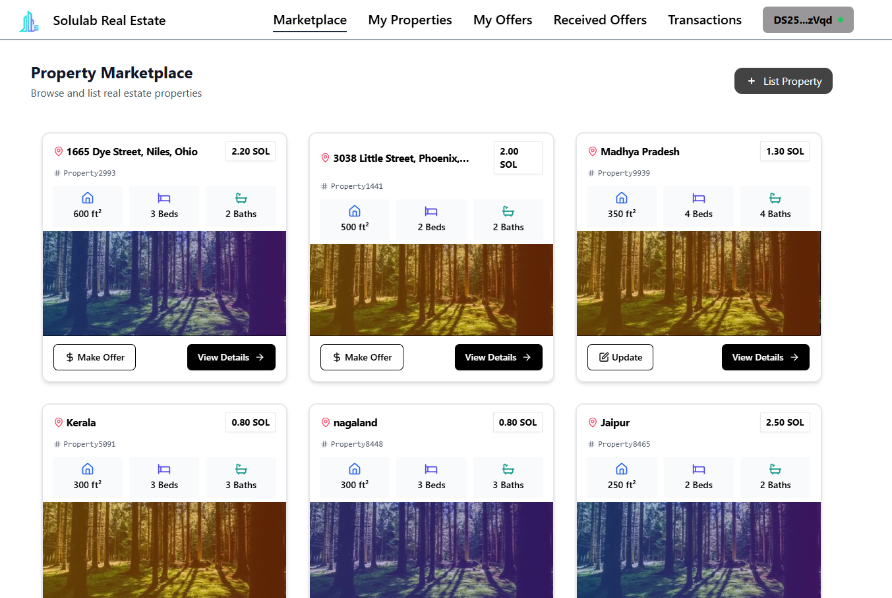
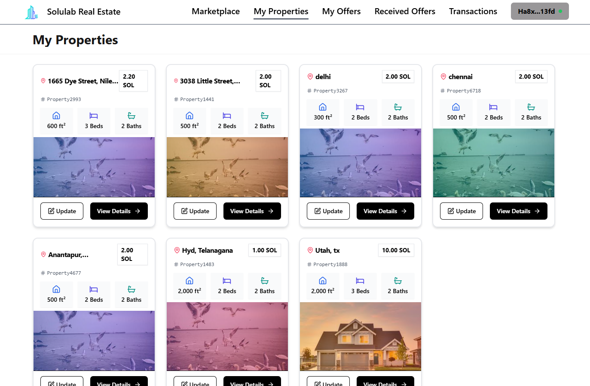
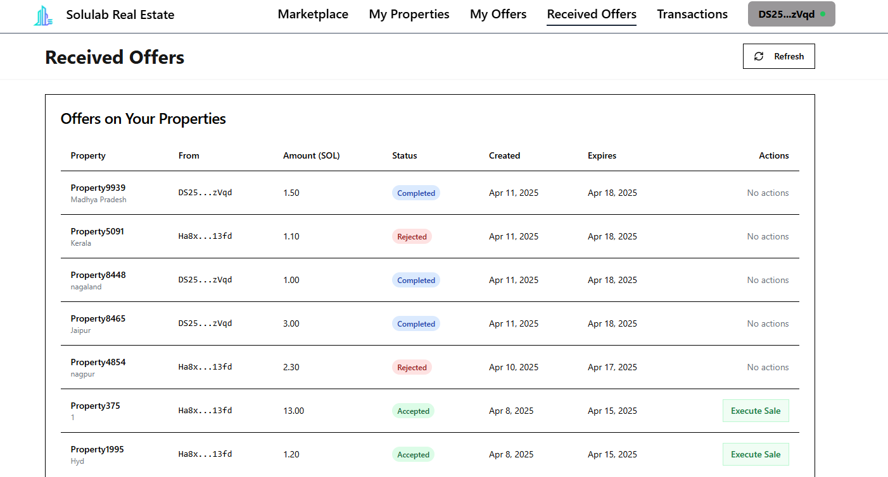
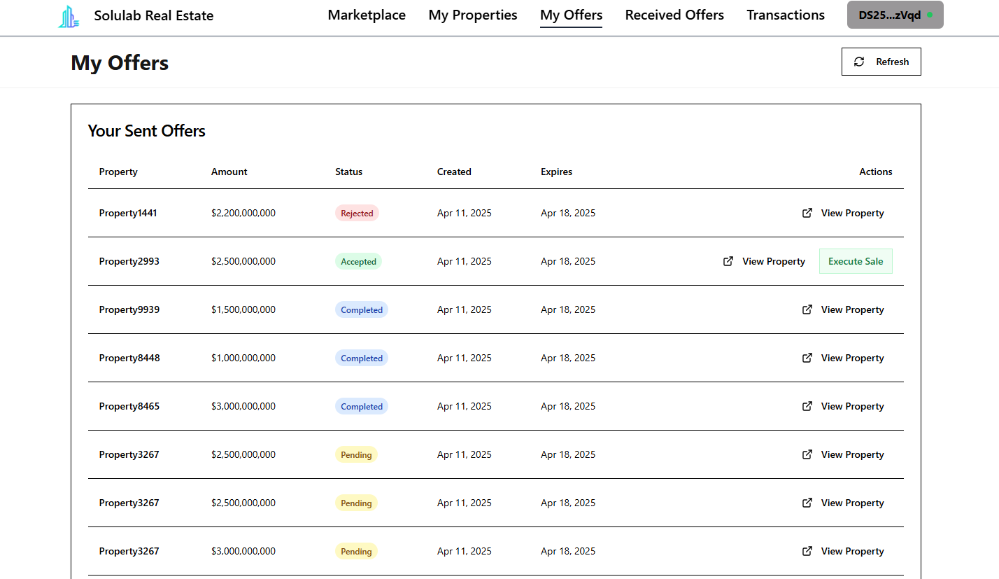
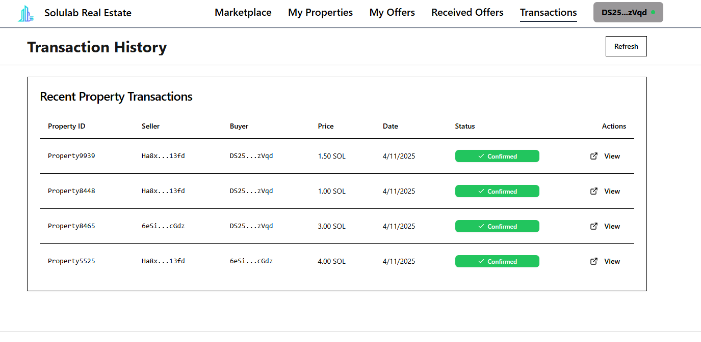

# Solulab Real Estate Marketplace

A decentralized real estate marketplace built on the Solana blockchain, offering a secure, efficient, and modern platform for property transactions. This full-stack application integrates a React-based frontend, a Rust-based backend using Actix, and a Solana smart contract developed with Anchor to enable seamless property listings, offers, and transactions.

## 🌟 Features

- **Decentralized Property Listings**: List, browse, and manage real estate properties as NFTs on the Solana blockchain.
- **Secure Transactions**: Execute property sales through Solana smart contracts with escrow management.
- **Wallet Integration**: Seamless connection with Solana wallets (e.g., Phantom) for authentication and transactions.
- **Modern UI/UX**: Responsive frontend built with React, TypeScript, Tailwind CSS, and Shadcn UI components.
- **Real-time Updates**: Live updates for property statuses, offers, and transactions via WebSocket and React Query.
- **Robust Backend**: REST API with Actix and PostgreSQL for off-chain data management.
- **Comprehensive Transaction Flow**: Supports property listing, offer submission, offer acceptance/rejection, and sale execution with NFT transfers.
- **Security**: Wallet signature verification, JWT authentication, data encryption, and smart contract safeguards.

## 🛠 Technical Stack

### Frontend
- **React 18**: Modern UI framework for dynamic interfaces.
- **TypeScript**: Type-safe development for reliability.
- **Vite**: Fast frontend tooling for development and builds.
- **Tailwind CSS**: Utility-first CSS framework for styling.
- **Shadcn UI**: High-quality, accessible UI components.
- **React Query**: Efficient data fetching and synchronization.
- **React Hook Form**: Simplified form handling with validation.
- **Framer Motion**: Smooth animations for enhanced UX.
- **@solana/web3.js**: Solana blockchain interactions.
- **@solana/wallet-adapter**: Wallet connection and management.

### Backend
- **Actix Web**: High-performance Rust framework for REST API.
- **Diesel**: ORM for PostgreSQL database operations.
- **PostgreSQL**: Serverless database (via Neon) for off-chain storage.
- **Rust**: Safe and efficient backend logic.
- **@project-serum/anchor**: Solana smart contract integration.

### Blockchain
- **Solana**: High-performance blockchain for fast, low-cost transactions.
- **Anchor Framework**: Rust-based framework for Solana smart contracts.
- **SPL Token**: Token standard for property NFTs.
- **Smart Contracts**: Manage property listings, offers, escrow, and sales with NFT-based ownership.

## 🚀 Getting Started

### Prerequisites
- Node.js (v16 or higher): For frontend development.
- **Yarn**: Package manager for frontend dependencies.
- **Rust**: Latest stable version for backend and smart contract development.
- Solana CLI Tools (v1.17 or later): For blockchain interactions.
- PostgreSQL (14.0 or later): For backend database.
- Solana Wallet (e.g., Phantom): For testing transactions.
- **Anchor CLI**: For Solana smart contract deployment.

### Project Structure

solulab-real-estate-marketplace/
├── app/                    # Frontend React application
├── backend/                # Actix backend and database logic
├── programs/               # Solana smart contract (Anchor)
├── tests/                  # Integration tests for Solana program
├── README.md               # Project documentation
└── LICENSE                 # MIT License

### Installation

1. **Clone the Repository**:
   
   git clone <repository-url>
   cd solulab-real-estate-marketplace
   

2. **Frontend Setup**:
   - Navigate to the frontend directory:
     
     cd app
     
   - Install dependencies:
     
     npm install
     
   - Create a .env file:
     
     VITE_SOLANA_RPC_URL=<your-solana-rpc-url>
     VITE_BACKEND_URL=<your-backend-api-url>
     
   - Start the development server:
     
     npm run dev
     

3. **Backend Setup**:
   - Navigate to the backend directory:
     
     cd backend
     
   - Install dependencies:
     
     cargo build
     
   - Create a .env file:
     
     DATABASE_URL=postgres://<username>:<password>@localhost/real_estate_db
     SOLANA_RPC_URL=https://api.devnet.solana.com
     ADMIN_PRIVATE_KEY=<your-admin-private-key>
     JWT_SECRET=<your-jwt-secret>
     PORT=8080
     
   - Run database migrations:
     
     diesel migration run
     
   - Start the backend server:
     
     cargo run
     

4. **Solana Smart Contract Setup**:
   - Navigate to the program directory:
     
     cd programs/real-estate-marketplace
     
   - Build the smart contract:
     
     anchor build
     
   - Deploy to Solana Devnet (ensure Solana CLI is configured):
     
     anchor deploy
     
   - Run tests to verify smart contract functionality:
     
     anchor test
     

### Environment Configuration

Ensure the following environment variables are set correctly:
- **Frontend**: Solana RPC URL and backend API URL.
- **Backend**: Database URL, Solana RPC URL, admin private key, and JWT secret.
- **Smart Contract**: Solana cluster (e.g., Devnet) configured via Solana CLI.

## 🔄 User Flow

### 1. Wallet Connection & Authentication
- Users connect their Solana wallet (e.g., Phantom) via the frontend.
- The backend verifies the wallet signature and issues a JWT token.
- User profiles are created/retrieved from the PostgreSQL database.

### 2. Property Browsing & Search
- Browse featured properties on the homepage.
- View detailed property pages with metadata (location, price, size, etc.).
- Search and filter properties based on preferences.

### 3. Property Listing
- **Create Listing**:
  - Fill out a form with property details (title, description, price, location, etc.).
  - Upload image URLs for property media.
  - Submit and pay a listing fee in SOL.
- **Blockchain Process**:
  - The Solana smart contract mints a property NFT.
  - The backend stores metadata in PostgreSQL.
  - Users receive an NFT receipt confirming ownership.

### 4. Making & Managing Offers
- **Submit Offer**:
  - Enter offer amount and contingencies.
  - Sign and submit the offer transaction via the wallet.
- **Manage Offers**:
  - Track offer status in real-time.
  - Receive notifications for counter-offers.
  - Accept or reject counter-offers.
- **Transaction**:
  - Funds are held in a Solana escrow account.
  - The smart contract executes the transfer upon acceptance.

### 5. Property Management Dashboard
- **Sellers**:
  - View and edit listed properties.
  - Monitor viewing statistics and offer statuses.
  - Access transaction history.
- **Buyers**:
  - Track submitted offers and favorite properties.
  - Manage purchased properties and documents.
- **Notifications**:
  - Real-time updates on offers and transactions.

### 6. Transaction Completion
- **Closing**:
  - The smart contract executes the sale, transferring funds from escrow.
  - The property NFT is transferred to the buyer.
- **Post-Transaction**:
  - Ownership is updated on-chain and in the database.
  - Users receive transaction confirmations and NFT receipts.

## 📡 API Endpoints

### Authentication
- POST /api/auth/connect: Connect wallet and authenticate.
- POST /api/auth/verify: Verify wallet signature.
- POST /api/auth/refresh: Refresh JWT token.

### Property Management (Database)
- GET /api/properties: List all properties.
- POST /api/properties: Create a new property listing.
- GET /api/properties/{id}: Get property details.
- PUT /api/properties/{id}: Update property listing.
- DELETE /api/properties/{id}: Remove property listing.

### Offer Management (Database)
- POST /api/offers: Submit a new offer.
- GET /api/offers/{id}: Get offer details.
- PUT /api/offers/{id}: Update offer.
- POST /api/offers/{id}/accept: Accept an offer.
- POST /api/offers/{id}/reject: Reject an offer.

### Transaction Management (Blockchain)
- POST /api/transactions/prepare: Prepare a transaction.
- POST /api/transactions/submit: Submit a signed transaction.
- GET /api/transactions/{id}: Get transaction status.

## 🔐 Security

- **Frontend**:
  - Secure wallet integration with signature verification.
  - Input validation and sanitization for forms.
- **Backend**:
  - JWT-based authentication with wallet signatures.
  - Rate limiting, CORS, and SQL injection prevention.
  - Encrypted database connections.
- **Blockchain**:
  - Smart contract validation for ownership and funds.
  - Escrow accounts with multi-signature requirements.
  - Time-locked transactions and dispute resolution mechanisms.
  - NFT-based ownership to prevent unauthorized transfers.

## 📊 Smart Contract Details

The Solana smart contract, built with Anchor, manages the core marketplace logic:

- **Marketplace Initialization**:
  - Sets up the marketplace with an authority and fee percentage.
- **Property Listing**:
  - Mints an NFT for each property, storing metadata on-chain.
  - Validates property details (ID, price, location, etc.).
- **Offer Management**:
  - Allows buyers to submit offers with SOL held in escrow.
  - Supports offer acceptance, rejection, or expiration.
- **Sale Execution**:
  - Transfers the property NFT to the buyer.
  - Distributes funds to the seller (minus marketplace fees).
  - Records transaction history on-chain.
- **States**:
  - Properties: LISTED, OFFER_RECEIVED, UNDER_CONTRACT, ESCROW_FUNDED, COMPLETING_SALE, SOLD.
  - Offers: Pending, Accepted, Rejected, Completed, Expired.

The contract includes error handling for invalid inputs, unauthorized actions, and arithmetic overflows, ensuring robust operation.

## 🧪 Testing

- **Frontend**: Unit tests for components and integration tests for user flows (not included in provided code).
- **Backend**: Tests for API endpoints and database operations (not included in provided code).
- **Smart Contract**:
  - Comprehensive tests using Anchor's testing framework.
  - Covers marketplace initialization, property listing, updates, offer creation, responses, and sale execution.
  - Run tests with:
    
    anchor test
    

## 📸 Screenshots

Below are screenshots showcasing key features of the Solulab Real Estate Marketplace:

### Property Marketplace

    

The marketplace view where users can browse and list properties, with options to Make Offer or View Details. This decentralized approach leverages Solana blockchain technology to ensure secure and transparent property listings.

### My Properties

    

Displays a grid of properties owned by the user, with details like location, price, size, beds, baths, and options to Update or View Details. Each property is represented as an NFT on the Solana blockchain.

### Received Offers

    

Lists offers received on the user's properties, with details like Property, From, Amount, Status, Created Date, Expires Date, and Actions (e.g., Execute Sale). All offer transactions are handled securely through Solana smart contracts.

### My Offers

    

Shows a table of offers sent by the user, including Property, Amount, Status, Created Date, Expires Date, and Actions (e.g., Execute Sale). Offers are secured with escrow functionality to ensure transaction safety.

### Transaction History

    

Displays recent property transactions with details like Property ID, Seller, Buyer, Price, Date, Status, and Actions. The blockchain provides an immutable record of all property transactions for complete transparency.

## 📄 License

This project is licensed under the MIT License. See the LICENSE file for details.